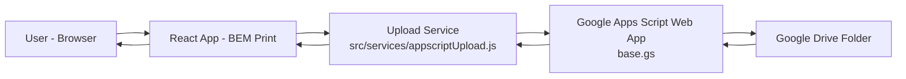
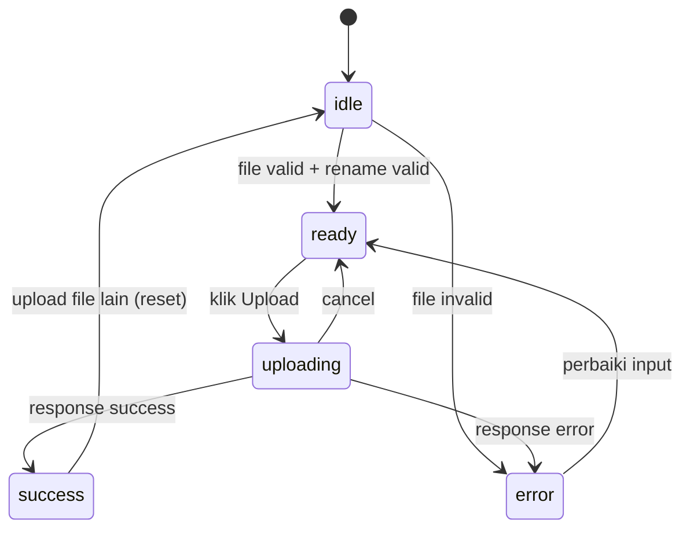
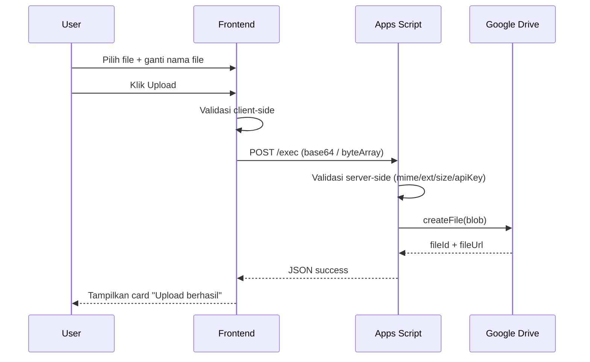
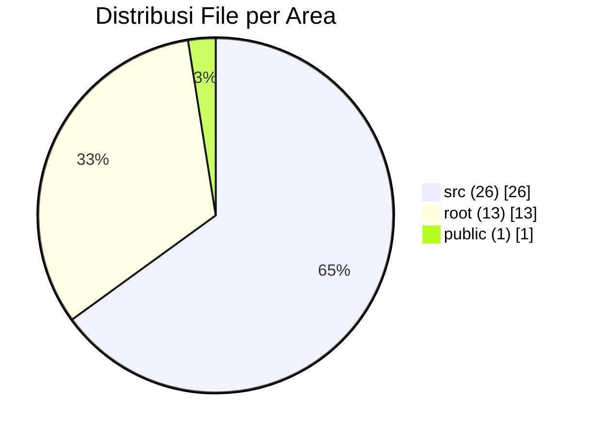
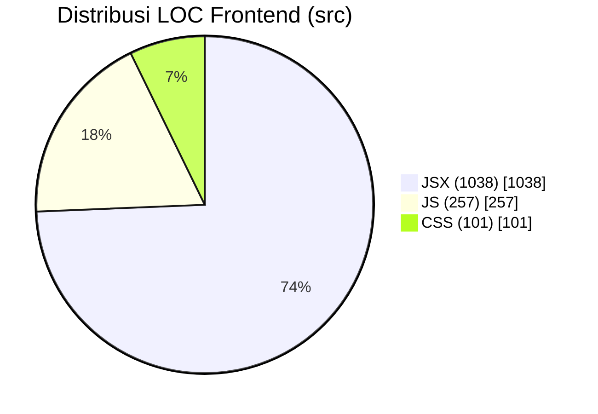
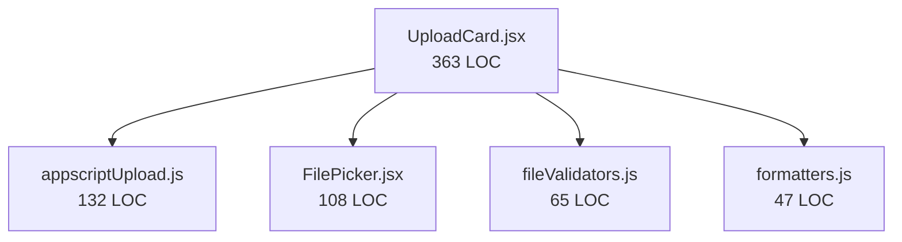
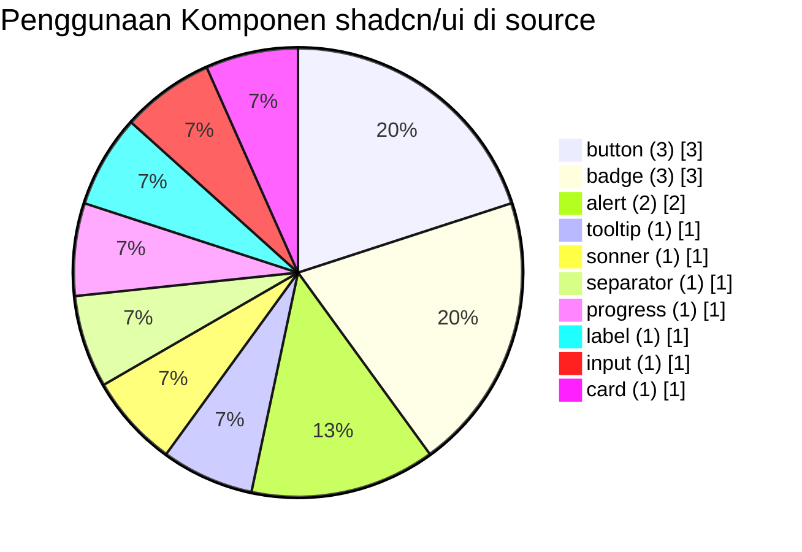

# BEM Print 🖨️

> Aplikasi uploader modern berbasis React + shadcn/ui untuk mengirim dokumen ke Google Drive melalui Google Apps Script.


---

## 📚 Daftar Isi

- [1. Ringkasan Proyek](#1-ringkasan-proyek)
- [2. Fitur Utama](#2-fitur-utama)
- [3. Tech Stack](#3-tech-stack)
- [4. Arsitektur Sistem](#4-arsitektur-sistem)
- [5. Alur Upload (State & Sequence)](#5-alur-upload-state--sequence)
- [6. Struktur Direktori](#6-struktur-direktori)
- [7. Validasi File](#7-validasi-file)
- [8. Konfigurasi Environment](#8-konfigurasi-environment)
- [9. Setup & Menjalankan Proyek](#9-setup--menjalankan-proyek)
- [10. Integrasi Google Apps Script](#10-integrasi-google-apps-script)
- [11. Kontrak API Upload](#11-kontrak-api-upload)
- [12. Keamanan](#12-keamanan)
- [13. UX & UI Notes](#13-ux--ui-notes)
- [14. Testing Checklist](#14-testing-checklist)
- [15. Troubleshooting](#15-troubleshooting)
- [16. Statistik Repo (Visualisasi)](#16-statistik-repo-visualisasi)
- [17. Roadmap Pengembangan](#17-roadmap-pengembangan)
- [18. Lisensi](#18-lisensi)

---

## 1. Ringkasan Proyek

**BEM Print** adalah web uploader untuk upload 1 file (single upload) ke Google Drive dengan backend Google Apps Script (`base.gs`).

Fokus implementasi:

- ✅ Clean architecture (frontend modular)
- ✅ Validasi ketat di client & server
- ✅ Dark/Light mode (manual toggle)
- ✅ UX modern dengan animasi (Framer Motion)
- ✅ Integrasi API key opsional
- ✅ SEO sederhana + Open Graph

---

## 2. Fitur Utama

- 📤 Upload 1 file ke Google Drive
- 🧾 Rename file wajib sebelum upload
- 🚫 Nama default (nama asli) tidak boleh dipakai saat submit
- 🧠 Auto-fill nama dari file asli (tanpa ekstensi)
- 📏 Limit file maksimal **30MB**
- 🗂️ Tipe file yang diizinkan:
  - Word (`.doc`, `.docx`)
  - Excel (`.xls`, `.xlsx`)
  - PDF (`.pdf`)
  - Gambar (`.png`, `.jpg`, `.jpeg`, `.webp`, `.gif`)
- 🌀 Simulated upload progress + cancel
- ✅ State upload lengkap: `idle`, `ready`, `uploading`, `success`, `error`
- 🧩 UI 100% komponen shadcn/ui (custom wrappers)
- 🌗 Theme toggle hanya **light/dark** (tidak ada mode system/device)

---

## 3. Tech Stack

### Frontend

- **React 19**
- **Vite**
- **Tailwind CSS v4**
- **shadcn/ui pattern** (wrapper component di `src/components/ui/*`)
- **Framer Motion** (animasi)
- **Lucide React** (ikon)
- **Sonner** (toast)

### Backend

- **Google Apps Script** (`base.gs`)
- Drive API via `DriveApp`

---

## 4. Arsitektur Sistem



Komponen kunci:

- `UploadCard` = orchestrator state/form/upload
- `fileValidators` = validasi ekstensi, MIME, size
- `appscriptUpload` = build payload & request API
- `base.gs` = validasi server-side + simpan ke Drive

---

## 5. Alur Upload (State & Sequence)

### 5.1 State Machine



### 5.2 Sequence Upload



---

## 6. Struktur Direktori

```text
.
├── base.gs
├── index.html
├── package.json
├── src
│   ├── App.jsx
│   ├── main.jsx
│   ├── index.css
│   ├── components
│   │   ├── theme-provider.jsx
│   │   ├── theme
│   │   │   └── ThemeToggle.jsx
│   │   ├── ui
│   │   │   ├── alert.jsx
│   │   │   ├── badge.jsx
│   │   │   ├── button.jsx
│   │   │   ├── card.jsx
│   │   │   ├── input.jsx
│   │   │   ├── label.jsx
│   │   │   ├── progress.jsx
│   │   │   ├── separator.jsx
│   │   │   ├── sonner.jsx
│   │   │   └── tooltip.jsx
│   │   └── uploader
│   │       ├── FileMeta.jsx
│   │       ├── FilePicker.jsx
│   │       ├── UploadActions.jsx
│   │       ├── UploadCard.jsx
│   │       └── UploadProgress.jsx
│   ├── config
│   │   └── appscript.js
│   ├── lib
│   │   ├── fileValidators.js
│   │   ├── formatters.js
│   │   └── utils.js
│   └── services
│       └── appscriptUpload.js
└── README.md
```

---

## 7. Validasi File

### 7.1 Client-side (`src/lib/fileValidators.js`)

- Validasi extension whitelist
- Validasi MIME whitelist
- Validasi size `<= 30MB`
- Validasi rename:
  - wajib isi
  - tidak boleh spasi saja
  - wajib beda dari nama asli default

### 7.2 Server-side (`base.gs`)

- Validasi payload JSON
- Validasi mode (`base64` / `byteArray`)
- Normalisasi byte array
- Validasi nama file
- Validasi MIME + extension match
- Validasi ukuran file
- Validasi API key opsional

---

## 8. Konfigurasi Environment

Contoh `.env.example`:

```env
VITE_APP_SCRIPT_WEBAPP_URL=https://script.google.com/macros/s/AKFY.../exec
VITE_APP_SCRIPT_PAYLOAD_MODE=base64
VITE_APP_SCRIPT_API_KEY=
VITE_APP_SCRIPT_TIMEOUT_MS=120000
```

Penjelasan:

- `VITE_APP_SCRIPT_WEBAPP_URL`
  - URL endpoint Web App Apps Script (`/exec`)
- `VITE_APP_SCRIPT_PAYLOAD_MODE`
  - `base64` (recommended) atau `byteArray` (legacy)
- `VITE_APP_SCRIPT_API_KEY`
  - API key opsional untuk validasi server-side
- `VITE_APP_SCRIPT_TIMEOUT_MS`
  - timeout request upload dalam milidetik

---

## 9. Setup & Menjalankan Proyek

### 9.1 Install dependency

```bash
npm install
```

### 9.2 Jalankan mode development

```bash
npm run dev
```

### 9.3 Build production

```bash
npm run build
npm run preview
```

---

## 10. Integrasi Google Apps Script

### 10.1 Setup Script Properties (opsional API key)

Di Google Apps Script:

- Buka **Project Settings**
- Tambahkan Script Property:
  - Key: `UPLOAD_API_KEY`
  - Value: API key rahasia Anda

### 10.2 Deploy Web App

- **Deploy** → **New deployment**
- Type: **Web app**
- Execute as: **Me**
- Who has access: **Anyone** (atau sesuai kebutuhan)
- Copy URL `/exec` → isi ke `VITE_APP_SCRIPT_WEBAPP_URL`

### 10.3 Ganti folder tujuan upload

Pada `base.gs`, ubah:

```js
var folderId = "id gdrive";
```

dengan folder ID Drive Anda.

---

## 11. Kontrak API Upload

### 11.1 Request mode `base64`

**Method**: `POST`  
**URL**: `${WEBAPP_URL}?filename=...&mimeType=...&mode=base64`  
**Body**:

```json
{
  "filename": "laporan-2026.xlsx",
  "mimeType": "application/vnd.openxmlformats-officedocument.spreadsheetml.sheet",
  "encoding": "base64",
  "data": "UEsDBBQAAAAI...",
  "apiKey": "optional-key"
}
```

### 11.2 Request mode `byteArray` (legacy)

**Method**: `POST`  
**URL**: `${WEBAPP_URL}?filename=...&mimeType=...&mode=byteArray&apiKey=...`  
**Body**:

```json
[-119,80,78,71,13,10,26,10,...]
```

### 11.3 Response sukses

```json
{
  "success": true,
  "filename": "laporan-2026.xlsx",
  "fileId": "1AbCdEf...",
  "fileUrl": "https://drive.google.com/file/d/.../view",
  "mimeType": "application/vnd.openxmlformats-officedocument.spreadsheetml.sheet",
  "size": 123456
}
```

### 11.4 Response gagal

```json
{
  "success": false,
  "error": "API key tidak valid."
}
```

---

## 12. Keamanan

### 12.1 Yang sudah diterapkan

- ✅ Validasi file di client
- ✅ Validasi ulang di server
- ✅ Sanitasi nama file
- ✅ Validasi size limit server-side
- ✅ API key opsional di Apps Script

### 12.2 Catatan penting

- Variabel `VITE_*` dapat dibaca di browser.
- API key frontend adalah proteksi ringan, **bukan secret tingkat tinggi**.
- Rotasi API key berkala sangat disarankan.

### 12.3 Rekomendasi lanjutan

- Tambahkan logging audit upload (waktu, user, filename)
- Batasi rate upload per user/IP
- Tambahkan daftar domain asal yang diizinkan (jika diperlukan)

---

## 13. UX & UI Notes

- 🎨 Tema warna: off-white + aksen `#2563eb`
- 🌗 Theme toggle manual (light/dark)
- 🧠 Upload success mode:
  - Form upload disembunyikan
  - Menampilkan result card + aksi lanjutan
- 🔔 Feedback real-time via toast + alert inline
- 🌀 Motion micro-interaction dengan Framer Motion

---

## 14. Testing Checklist

### 14.1 Happy path

- [ ] Pilih file valid (< 30MB)
- [ ] Ubah nama file baru (wajib berbeda dari default)
- [ ] Upload sukses dan tampil link Drive

### 14.2 Negative case

- [ ] File > 30MB ditolak
- [ ] Ekstensi/MIME tidak valid ditolak
- [ ] Nama file kosong ditolak
- [ ] Nama file sama dengan default ditolak
- [ ] API key salah ditolak

### 14.3 UX case

- [ ] Cancel saat uploading
- [ ] Reset setelah sukses (`Upload file lain`)
- [ ] Dark/light mode tersimpan di localStorage

---

## 15. Troubleshooting

### ❗ CORS preflight error

Gejala umum:

- `blocked by CORS policy`
- `No 'Access-Control-Allow-Origin' header`

Solusi yang sudah dipakai di frontend:

- Jangan set header custom `Content-Type: application/json`
- Kirim body JSON string sebagai simple request (`text/plain` default browser)

### ❗ Upload selalu gagal API key

Periksa:

- `UPLOAD_API_KEY` di Script Properties
- `VITE_APP_SCRIPT_API_KEY` di `.env`
- Pastikan redeploy Apps Script setelah perubahan

### ❗ Upload sukses tapi file rusak

Periksa:

- `mode` sinkron antara frontend dan parser backend
- MIME type sesuai extension
- Payload base64 tidak terpotong

---

## 16. Statistik Repo (Visualisasi)

> Snapshot statistik lokal pada **11 Februari 2026** (tanpa `node_modules`).

### 16.1 Ringkasan angka

- Total file repo (tanpa `node_modules`): **40 file**
- Total ukuran repo (tanpa `node_modules`): **311 KB**
- Total file dalam `src`: **26 file**
- Total LOC source frontend (`src/*.js|jsx|css`): **1,396 LOC**

### 16.2 Distribusi file per area

| Area         | Jumlah File |
| ------------ | ----------: |
| `src`        |          26 |
| root project |          13 |
| `public`     |           1 |



### 16.3 Distribusi LOC source frontend

| Ekstensi | File |  LOC |
| -------- | ---: | ---: |
| `jsx`    |   19 | 1038 |
| `js`     |    5 |  257 |
| `css`    |    1 |  101 |



### 16.4 Komponen terbesar (LOC)

| File                                     | LOC |
| ---------------------------------------- | --: |
| `src/components/uploader/UploadCard.jsx` | 363 |
| `src/services/appscriptUpload.js`        | 132 |
| `src/components/uploader/FilePicker.jsx` | 108 |
| `src/lib/fileValidators.js`              |  65 |
| `src/lib/formatters.js`                  |  47 |



### 16.5 Statistik penggunaan komponen UI (`src`)

| Komponen UI | Jumlah Import |
| ----------- | ------------: |
| `button`    |             3 |
| `badge`     |             3 |
| `alert`     |             2 |
| `tooltip`   |             1 |
| `sonner`    |             1 |
| `separator` |             1 |
| `progress`  |             1 |
| `label`     |             1 |
| `input`     |             1 |
| `card`      |             1 |



> Catatan: statistik di atas adalah snapshot lokal struktur kode (bukan traffic analytics GitHub).

### 16.6 Cara regenerate statistik

Jalankan perintah berikut dari root project:

```bash
# Total file tanpa node_modules
find . -path './node_modules' -prune -o -type f -print | wc -l

# Ukuran repo tanpa node_modules
du -sh . --exclude=node_modules

# LOC frontend source
find src -type f \( -name '*.js' -o -name '*.jsx' -o -name '*.css' \) -print \
| while read -r f; do wc -l "$f"; done \
| awk '{s+=$1} END{print s+0}'
```

---

## 17. Roadmap Pengembangan

- [ ] Multi-file upload (batch)
- [ ] Progress upload real per chunk
- [ ] Drag-drop advanced dengan preview gambar
- [ ] Riwayat upload (dashboard)
- [ ] Admin analytics upload per hari
- [ ] Unit test + integration test otomatis

---

## 18. Lisensi

Lisensi mengikuti file [`LICENSE`](./LICENSE).

---

## ❤️ Credits

- Developer ❤️ by [`KhairizmiDEV`](https://haisyam.my.id).
- Dibuat untuk workflow upload dokumen BEM dengan pengalaman penggunaan yang modern, cepat, dan aman.
